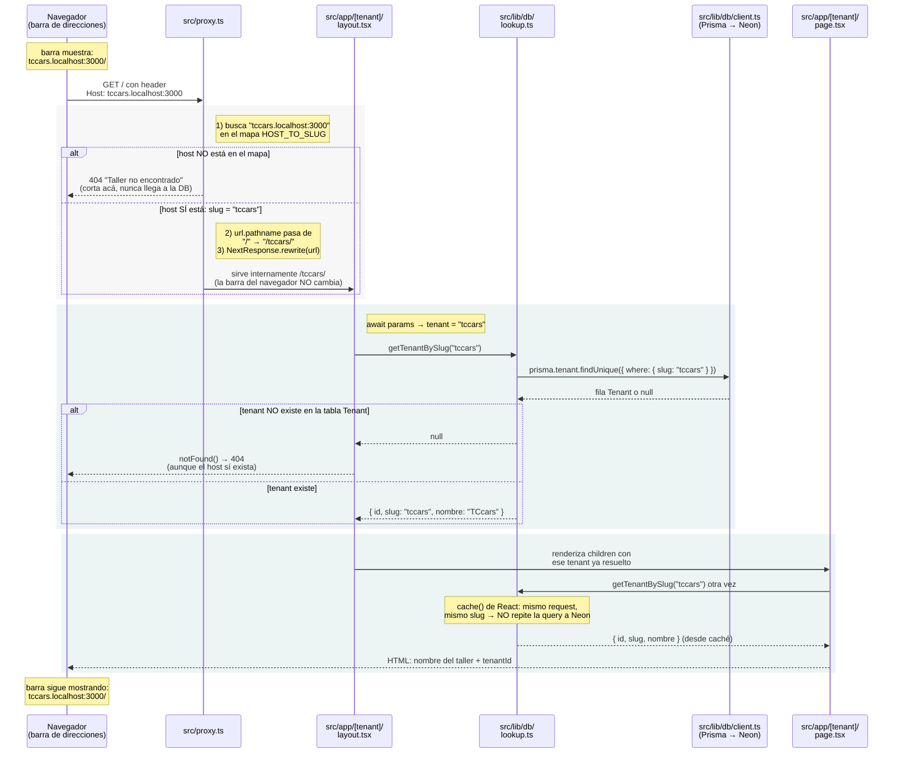

# 3. Flujo de resolución de tenant (`src/proxy.ts` → `src/app/[tenant]/`)

> Cierre del Sprint 1: qué pasa exactamente cuando alguien entra a `tccars.localhost:3000/`. Complementa a [`02-features.md`](./02-features.md), que explica el sistema de features usado dentro de este mismo flujo.

## Por qué hace falta transformar la URL

Next.js organiza las rutas por **carpetas de archivos**, y este proyecto tiene una sola: `src/app/[tenant]/`. No existe `src/app/tccars/` ni `src/app/demo/` — sería el fork de código que prohíbe la regla #1 de `CLAUDE.md` ("nunca `if (tenant === 'x')`. Toda diferencia entre talleres es una feature o un campo de configuración").

El problema es que el visitante **nunca escribe `/tccars/`** en la URL — entra por el subdominio: `tccars.localhost:3000/`. Pero Next, para elegir la carpeta correcta, necesita ver ese segmento `tenant` en la ruta:

| | |
|---|---|
| Lo que pide el navegador | `tccars.localhost:3000/` |
| Lo que Next necesita ver para enrutar | `/tccars/` |

`src/proxy.ts` es el traductor entre las dos. Reescribe (`rewrite`) la URL internamente — el navegador nunca se entera del cambio, su barra de direcciones sigue mostrando `tccars.localhost:3000/` todo el tiempo. Es distinto de un `redirect`, donde el navegador sí ve la nueva URL y dispara una segunda petición.

```ts
// src/proxy.ts
const url = request.nextUrl.clone();
url.pathname = `/${slug}${url.pathname}`;
// antes:   "/"
// después: "/tccars/"
return NextResponse.rewrite(url);
```

Sin este paso, cada taller necesitaría su propia carpeta de rutas (duplicando código), o la URL visible tendría que llevar el taller escrito a mano (`tudominio.com/tccars/`, feo y no es cómo se ven los subdominios). El rewrite da subdominio limpio para el usuario y una sola carpeta de código para el proyecto.

---

## Diagrama de secuencia



---

## Archivos en juego

| Archivo | Rol |
|---|---|
| `src/proxy.ts` | Corre antes que cualquier ruta. Lee el header `Host`, decide el slug y reescribe la URL. Es donde muere un host desconocido. |
| `src/app/[tenant]/layout.tsx` | Primer punto que ve el slug ya resuelto. Si el tenant no existe en la base, corta con `notFound()`. |
| `src/lib/db/lookup.ts` | Expone `getTenantBySlug`, envuelta en `cache()` de React para no repetir la query dentro del mismo request. |
| `src/lib/db/client.ts` | Único `PrismaClient` del proyecto, conectado a Neon vía el adapter. Nadie más lo instancia. |
| `src/app/[tenant]/page.tsx` | Vuelve a pedir el tenant (deduplicado) y renderiza el nombre del taller y su `tenantId`. |

## Construido en Sprint 1, todavía sin usar en este flujo

- **`src/lib/db/tenant.ts`** — `forTenant(tenantId)`: cliente Prisma que inyecta `tenantId` en todo query. Se usará cuando existan modelos con datos propios del taller (clientes, órdenes).
- **`src/features/assertFeature.ts`** — `assertFeature` / `assertFeatureOrNotFound`: el gate de features (ver [`02-features.md`](./02-features.md)). Se usará cuando existan server actions y módulos reales que gatear.

---

**Verificado en navegador — 2026-08-12:** `tccars.localhost:3000` y `demo.localhost:3000` muestran cada uno su taller; un host desconocido devuelve "Taller no encontrado"; una ruta inexistente dentro de un tenant válido devuelve 404. No hizo falta editar `/etc/hosts`: macOS y los navegadores modernos resuelven `*.localhost` a `127.0.0.1` automáticamente (RFC 6761).

**Siguiente:** Sprint 2 — identidad, roles y alta de talleres.
