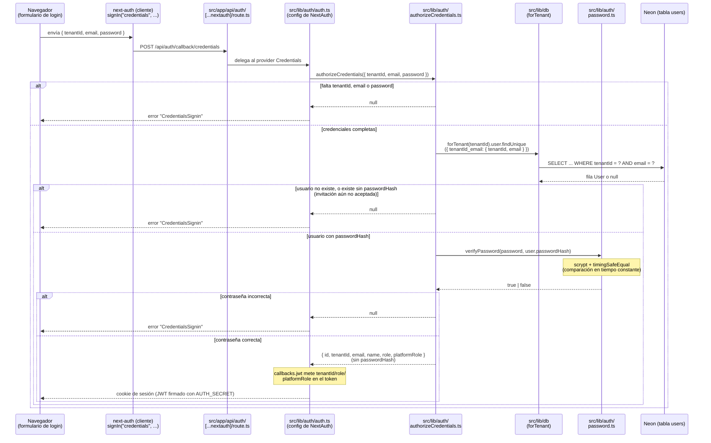

# 4. Login del staff y roles (`src/lib/auth/`, Sprint 2 — en curso)

> Diagrama de fin de sprint: regla nueva agregada a `CLAUDE.md` en este mismo sprint — cada sprint cerrado documenta acá su flujo, con archivos y el porqué de cada pieza, no solo el qué. Cubre lo construido hasta ahora en Sprint 2: schema de roles, `assertRole`, hash de contraseña y el login completo. **Faltan** invitaciones por email, panel de plataforma y correlativo de mantenciones — el sprint sigue abierto.

## El problema que resuelve cada pieza (por qué existe, no solo qué hace)

| Pieza | Por qué existe |
|---|---|
| `StaffRole` en el schema | Sin un campo tipado, "rol" sería un string libre — cualquiera podría escribir `"Admin"` con mayúscula distinta y romper un `assertRole` silenciosamente |
| `passwordHash` nullable en `User` | Un usuario invitado existe en la tabla antes de aceptar la invitación (para poder mandarle el link); `null` es literalmente "invitación pendiente, todavía no puede loguearse" |
| `src/lib/auth/password.ts` | Nunca se guarda una contraseña en texto plano (estándar de seguridad básico). `scrypt` es nativo de Node — cero dependencias nuevas |
| `authorizeCredentials` en archivo aparte de `auth.ts` | Next-auth es difícil de testear directo (arrastra imports internos de Next). Separando la lógica de negocio del "pegamento" de next-auth, se puede testear con Vitest sin mockear medio framework |
| `tenantId` viajando en las credenciales del login | `User` es único por `[tenantId, email]`, no por `email` solo — el mismo correo puede existir en dos talleres. Sin `tenantId`, el login no sabría a cuál de los dos se refiere |

---

## Diagrama de secuencia: un intento de login



## Cómo se usa la sesión después del login

Una vez logueado, cada server action o página puede leer `session.user.tenantId` y `session.user.role` sin volver a consultar la base — vienen ya dentro del JWT firmado:

```ts
const session = await auth();
await assertRole(session.user.role, "ADMIN");     // src/lib/auth/assertRole.ts
const db = forTenant(session.user.tenantId);       // src/lib/db/tenant.ts
```

---

## Archivos en juego

| Archivo | Rol |
|---|---|
| `prisma/schema.prisma` | `StaffRole`, `PlatformRole`, `passwordHash`, `version` en `User`; modelo `Invitation` |
| `src/lib/auth/password.ts` | Hash (`scrypt` + salt aleatorio) y verificación (`timingSafeEqual`) de contraseñas |
| `src/lib/auth/authorizeCredentials.ts` | La lógica real del login: valida credenciales, busca el usuario scoped al tenant, verifica la contraseña. Sin dependencia de next-auth — testeable en aislamiento |
| `src/lib/auth/auth.ts` | Configuración de Auth.js: provider Credentials (usa `authorizeCredentials`), sesión JWT, callbacks que copian `tenantId`/`role`/`platformRole` al token y a la sesión |
| `src/app/api/auth/[...nextauth]/route.ts` | Expone las rutas que Auth.js necesita (`/api/auth/callback/credentials`, etc.) |
| `src/lib/auth/assertRole.ts` | Gate por rol para server actions (`assertRole`) y páginas (`assertRoleOrNotFound`), con la jerarquía `MECANICO < RECEPCION < ADMIN < OWNER` |

## Construido en este sprint, todavía sin usar

- **Formulario de login real** — no existe página `/[tenant]/login` todavía; el flujo de arriba está probado a nivel de `authorizeCredentials`, pero nadie lo dispara desde la UI aún
- **`Invitation`** (modelo) — la tabla existe en la base, pero no hay server action que la cree ni que la acepte
- **Panel de plataforma** (`platformRole`) — el campo existe y la jerarquía está pensada (tenant especial `slug: "plataforma"`), pero no hay ruta ni UI todavía
- **Correlativo de mantenciones inicializable en el alta** — pendiente, es la última pieza del Sprint 2

---

**Estado:** Sprint 2 en curso. Próximo paso: invitaciones por email (Resend) y el flujo de aceptación que crea el `passwordHash`.
