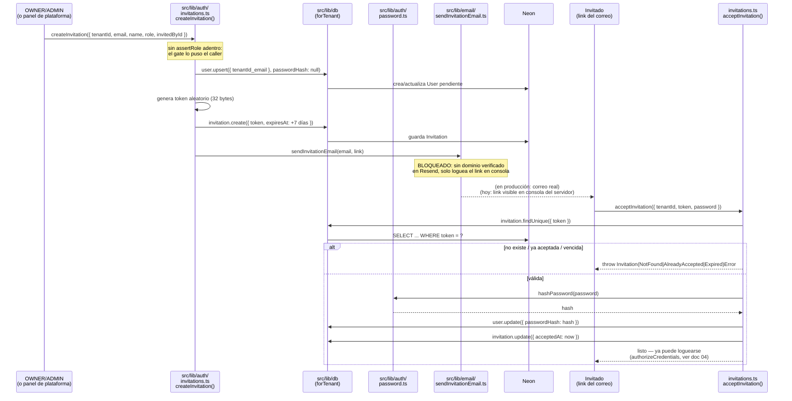
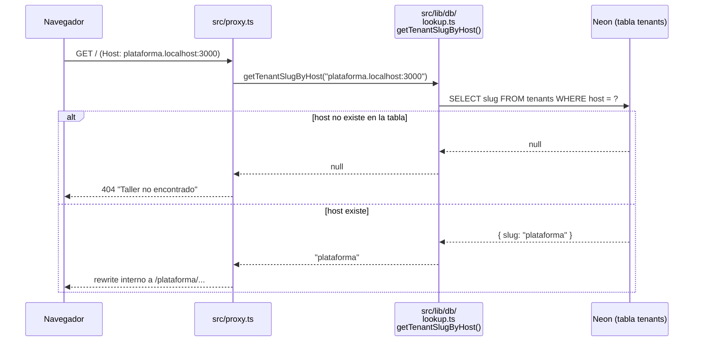

# 5. Invitaciones, proxy dinámico y tenant plataforma (Sprint 2, cont.)

> Continúa a [`04-login-y-roles.md`](./04-login-y-roles.md). Cubre lo construido después: invitaciones (con envío mockeado hasta tener dominio), `proxy.ts` resolviendo por base de datos en vez de mapa fijo, el tenant especial `"plataforma"` y su gate `assertPlatformRole`. **Falta todavía**: la UI del panel de plataforma (listar talleres + formulario de alta) y el correlativo de mantenciones — Sprint 2 sigue sin cerrar.

## El problema que resuelve cada pieza

| Pieza | Por qué existe |
|---|---|
| `sendInvitationEmail` como función aparte | Sin dominio propio verificado, Resend no deja enviar ningún correo (lo exige, sin excepción). Aislar el envío en una sola función significa que cuando haya dominio, se cambia un archivo y nada más se entera |
| `createInvitation` / `acceptInvitation` sin `assertRole` adentro | El panel de plataforma crea el primer `OWNER` de un taller nuevo — ahí no existe todavía ningún `ADMIN` que lo autorice. Meter el gate adentro de la función rompía ese caso. El gate lo pone quien llama, no la función de datos |
| `getTenantSlugByHost` (nueva) vs `getTenantBySlug` (ya existía) | Una busca por *slug* (la usa `layout.tsx`, ya con la URL reescrita), la otra por *host* (la usa `proxy.ts`, antes de reescribir nada). Son preguntas distintas aunque suenen parecidas |
| `proxy.ts` ahora consulta la base | Antes el mapa `HOST_TO_SLUG` era fijo en código — agregar un taller (o el tenant `plataforma`) significaba editar y desplegar. Ahora es una fila más en la tabla `Tenant`, cero despliegues |
| `ws` como dependencia nueva | Las transacciones de Prisma (`$transaction`, la usa `seedTenant`) necesitan `WebSocket`. El navegator y el runtime edge del proxy ya lo traen; un script de Node plano (`tsx prisma/seedPlatform.ts`) en esta versión de Node no — sin `ws`, sembrar la plataforma fallaba con error de conexión |
| Tenant `"plataforma"` en vez de una ruta especial fuera de `[tenant]` | Reutiliza *todo* el mecanismo que ya existe (proxy, layout, resolución de tenant) sin escribir un solo caso especial — la decisión que tomamos al planear el sprint |
| `platformRole` separado de `role` | Son dos preguntas distintas: "¿qué puede hacer dentro de su taller?" vs "¿puede administrar la plataforma entera?". Mezclarlas habría obligado a inventar un rol `"SUPERADMIN"` dentro de `StaffRole`, que no tiene sentido dentro de un taller normal |

---

## Diagrama de secuencia: crear una invitación y aceptarla

## Diagrama de secuencia: `proxy.ts` resolviendo por base de datos

**Costo del cambio, dicho explícitamente:** antes esta resolución era instantánea (mapa en memoria); ahora cada request le pega a Neon (~200ms medido en dev, más en el primer request por cold start). Se decidió no cachear todavía — medir antes de optimizar.

---

## Archivos en juego (nuevos en esta parte)

| Archivo | Rol |
|---|---|
| `src/lib/auth/invitations.ts` | `createInvitation` / `acceptInvitation` — la lógica de datos, sin gate de rol adentro |
| `src/lib/email/sendInvitationEmail.ts` | Único punto de contacto con el envío real. Hoy solo loguea |
| `src/lib/db/lookup.ts` | Suma `getTenantSlugByHost` junto a `getTenantBySlug` |
| `src/proxy.ts` | Pasa de mapa fijo a `await getTenantSlugByHost(host)` |
| `src/lib/db/tenant.ts` | `Invitation` sumado a `TENANT_SCOPED_MODELS` (regla #8: todo índice/query empieza por `tenantId`) |
| `src/lib/db/client.ts` | Configura `ws` como implementación de `WebSocket` cuando falta (Node plano), sin afectar el bundle edge del proxy |
| `prisma/seedPlatform.ts` | Siembra el tenant `plataforma` (vía `seedTenant`, reutilizado) y la cuenta `SUPERADMIN`, leyendo credenciales de `.env` — nunca hardcodeadas |
| `src/lib/auth/assertPlatformRole.ts` | Gate del otro eje: `assertPlatformRole` / `assertPlatformRoleOrNotFound`, hermano de `assertRole` pero para `platformRole` |

## Construido hoy, todavía sin usar

- **UI del panel de plataforma** — `assertPlatformRole` existe y el tenant `plataforma` está sembrado, pero no hay ninguna página que los use todavía. Es lo próximo
- **Correlativo de mantenciones inicializable en el alta** — no empezado
- **Página `/[tenant]/invitacion/[token]`** — el `acceptInvitation` está probado por test, pero nadie lo llama desde una UI real todavía

---

**Estado:** Sprint 2 sigue en curso (no cerrado formalmente — falta la UI del panel y el correlativo). Este documento cierra la sesión de hoy, no el sprint. Al retomar: construir el panel de plataforma sobre las piezas ya listas (`assertPlatformRole`, `createInvitation`, `seedTenant`).
