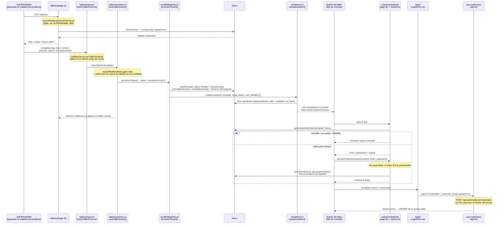

# 6. Panel de plataforma: alta, invitación y login (cierre del Sprint 2)

> Continúa a [`05-invitaciones-y-plataforma.md`](./05-invitaciones-y-plataforma.md), que dejó toda la lógica de datos lista (`createInvitation`, `acceptInvitation`, `assertPlatformRole`, `seedTenant`) pero **sin ninguna pantalla que la usara**. Este documento cubre justo eso: las páginas que faltaban, más el correlativo de mantenciones — con lo que se cierra el Sprint 2.

## Por qué el orden importó

Se construyó en este orden porque cada pieza dependía de poder *ver* la anterior funcionando en el navegador:

1. **Panel de plataforma** (listar talleres + form de alta) — sin esto, no hay forma de crear un taller de prueba.
2. **Login** — sin esto, nadie puede entrar al panel (`assertPlatformRoleOrNotFound` exige sesión).
3. Al armar el login apareció un bug real: `src/proxy.ts` reescribía **todo**, incluido `/api/auth/*` (donde vive NextAuth), rompiendo `signIn()`. Se corrigió antes de seguir.
4. **Logout** — se notó que faltaba al ya estar logueado sin forma de salir.
5. **Aceptar invitación** — sin esto, el admin de un taller nuevo queda con `passwordHash: null` para siempre; no hay forma de probar el ciclo completo.
6. **Correlativo de mantenciones** — el único pendiente que quedaba del Sprint 2 en `docs/plan.md`.

## shadcn/ui, sumado al stack

Hasta acá los formularios eran HTML a mano con clases de Tailwind sueltas. Se inicializó shadcn/ui (`npx shadcn@latest init`) y se agregó como regla no negociable (#12 de `CLAUDE.md`): toda UI nueva usa sus componentes (`src/components/ui/`), instalados con `npx shadcn@latest add <componente>`.

Un detalle no obvio: shadcn/ui en este proyecto usa [Base UI](https://base-ui.com) como motor de los componentes (no Radix, que es lo que la mayoría de tutoriales de shadcn muestran). Dos consecuencias concretas:

- El `Select` es un componente **controlado** (no un `<select>` nativo), así que se conecta con `Controller` de react-hook-form en vez de `register`.
- El `Button` de Base UI **no debe envolver un `<Link>`** a través de su prop `render` (los links tienen semántica propia). Para un link que se ve como botón se usa `buttonVariants({ variant })` como `className` de un `<Link>` normal.

## zod como única fuente de validación

Cada formulario (`talleres/schema.ts`, `login/schema.ts`, `invitacion/[token]/schema.ts`) define un schema de zod que se usa en **dos lugares**: react-hook-form en el cliente (feedback inmediato, sin ida y vuelta al servidor) y la server action correspondiente, que vuelve a correr `safeParse` sobre los mismos datos. El cliente nunca es confiable — regla implícita de todo el proyecto — así que la validación del cliente es una mejora de UX, no el gate real.

Un campo (`correlativoInicial`) usa `z.coerce.number()`, que acepta cualquier cosa coercible a número (el string que manda un `<input type="number">`). Eso vuelve "unknown" el *tipo de entrada* de zod para ese campo, distinto del *tipo de salida* (ya validado y convertido). Por eso `talleres/schema.ts` exporta dos tipos separados:

```ts
export type CrearTallerFormValues = z.input<typeof crearTallerSchema>;  // antes de validar
export type CrearTallerInput = z.output<typeof crearTallerSchema>;      // después de validar
```

Y el formulario tipa `useForm` con los tres genéricos de react-hook-form: `useForm<CrearTallerFormValues, unknown, CrearTallerInput>` — el callback de `handleSubmit` recibe automáticamente los datos ya en su forma de salida (`correlativoInicial` como `number`, no `string`).

## El bug del proxy y /api/auth

```ts
// antes
matcher: ["/((?!_next/static|_next/image|favicon.ico).*)"]

// después
matcher: ["/((?!_next/static|_next/image|favicon.ico|api).*)"]
```

`src/proxy.ts` reescribe cualquier ruta a `/<slug><pathname>`. Eso está bien para `/talleres` → `/plataforma/talleres`, pero `/api/auth/session` (donde vive NextAuth, en `src/app/api/auth/[...nextauth]/route.ts`, **fuera** de `[tenant]`) se reescribía a `/plataforma/api/auth/session` — una ruta que no existe. El navegador recibía un 404 en HTML donde `signIn()` esperaba JSON, y tiraba `ClientFetchError: Unexpected token '<'`. La corrección excluye `/api` completo del rewrite del proxy.

---

## Diagrama de secuencia: ciclo completo — crear taller → invitación → login



---

## Archivos en juego (nuevos en esta parte)

| Archivo | Rol |
|---|---|
| `src/app/[tenant]/talleres/page.tsx` | Panel de plataforma: lista talleres, gate `assertPlatformRoleOrNotFound` |
| `src/app/[tenant]/talleres/schema.ts` + `nuevo/NuevoTallerForm.tsx` + `actions.ts` | Alta de taller: schema compartido, form react-hook-form + shadcn, server action que re-valida y llama `provisionTenant` |
| `src/features/packages.ts` | Paquetes comerciales (`básico`/`operativo`/`completo`) → lista de features a activar |
| `src/app/[tenant]/login/` (`page.tsx`, `LoginForm.tsx`, `schema.ts`) | Login genérico por tenant: resuelve `tenantId` del slug de la URL, llama `signIn("credentials", ...)` |
| `src/lib/auth/actions.ts` (`logoutAction`) + `src/components/LogoutButton.tsx` | Cierre de sesión, sin gate de rol (cerrar tu propia sesión no toca datos del tenant) |
| `src/app/[tenant]/invitacion/[token]/` (`page.tsx`, `AceptarInvitacionForm.tsx`, `schema.ts`, `actions.ts`) | Acepta la invitación: resuelve el estado del token antes de mostrar nada, fija contraseña |
| `getInvitationByToken` (nuevo en `src/lib/auth/invitations.ts`) | Busca la invitación acotada al tenant, para decidir qué mostrar en la pantalla de invitación |
| `src/proxy.ts` (`config.matcher`) | Excluye `/api` del rewrite — corrige el bug que rompía `signIn()` |
| `prisma/schema.prisma` (`TenantConfig.correlativoActual`) | Contador de OT/mantenciones, sembrado en el alta, consumido recién en el Sprint 3 |
| `src/components/ui/*` | Componentes de shadcn/ui: `button`, `input`, `select`, `label`, `field`, `separator` |

## Construido en este sprint, todavía sin usar

- **`correlativoActual`** — existe y se siembra correctamente, pero nadie lo lee ni lo incrementa todavía. Eso es del Sprint 3 (creación de OT).
- **Envío real de correo** — `sendInvitationEmail` sigue mockeado (loguea en consola). Bloqueado por falta de dominio propio verificado en Resend.

---

**Estado al cierre — 2026-08-31:** `npm test` (91 tests), `tsc --noEmit` y `npm run lint` en verde. El login se probó en navegador y reveló el bug del proxy (ya corregido); el resto del ciclo (alta de taller → invitación → aceptación) está cubierto por tests pero **todavía no se verificó de punta a punta en el navegador** — es lo primero para confirmar antes de dar el sprint por completamente probado.

**Sprint 2 cerrado.** Siguiente: Sprint 3 — clientes, vehículos y órdenes de trabajo, a la espera de que se pida avanzar explícitamente.
